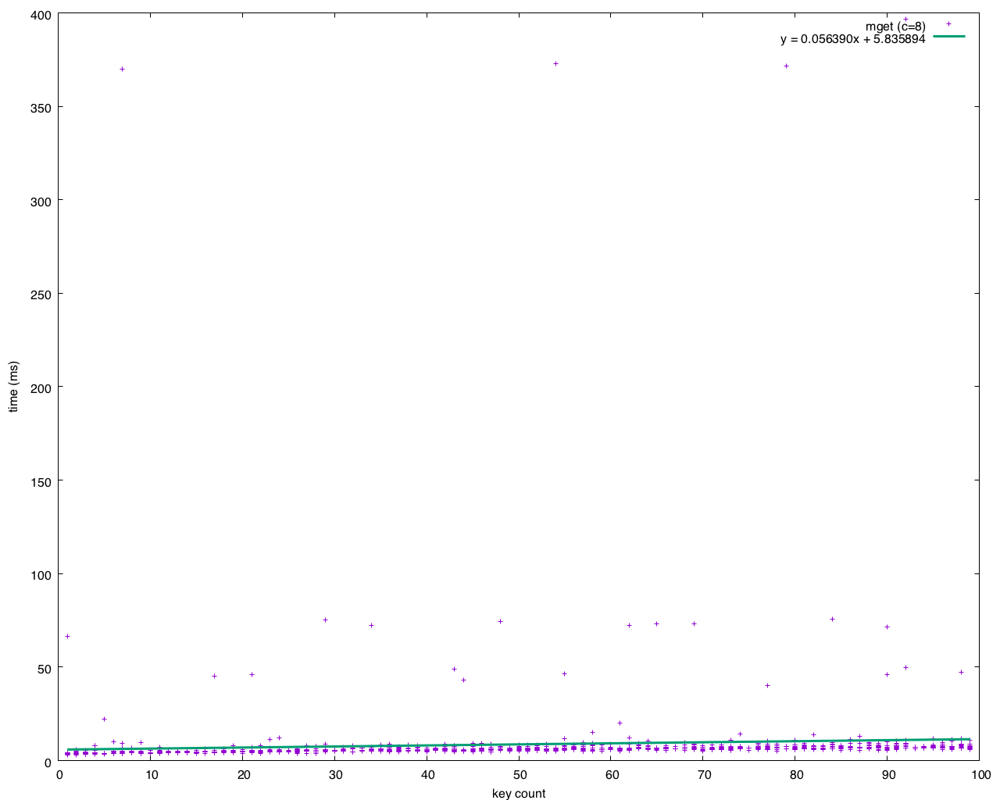

# GOBIGTABLEPERF

A test for [fetching](https://godoc.org/cloud.google.com/go/bigtable#Table.ReadRows)
performance in [BigTable](https://cloud.google.com/bigtable/docs/) via
[Google's SDK](https://godoc.org/cloud.google.com/go/bigtable).

Fetching from BigTable is the only thing being tested in this application. There
are some bulk writes and some admin operations, but those are not timed.

## Usage

| Global Parameters                                                              ||
| --------------------------- | ------------------------------------------------- |
| `--project value, -p value`  | Google Cloud project                             |
| `--instance value, -i value` | BigTable instance name                           |
| `--table value, -t value`    | BigTable table name (default: "gobigtable_test") |

### Command: `create-data`
Create the table with base data for the tests. This will create `count` rows of
random data of size `data-size`. The name of the table is set in the global
`table` value. If there is already a table of the same name, the command will
delete that table and make a new one. This operation is fairly slow, which is
why it has been broken out into its own command.

The table will have a single column family, `data`, with a single column,
`value` containing random bytes.

| Parameters                                                                        ||
| ------------------- | ------------------------------------------------------------ |
| `--count value`     | Number of entries to put into the test table (default: 5000) |
| `--data-size value` | Size of test data values, in bytes (default: 2048)           |

#### example
```bash
./gobigtableperf \
    --project bluecore-qa \
    --instance dangertest \
    create-data \
    --data-size 128 \
    --count 50000
```

### Command: `delete-data`
Destroy the table with base data for the tests. Note that this command does not
know if the table was created by this tool and will delete any table.

#### example
```bash
./gobigtableperf \
    --project bluecore-qa \
    --instance dangertest \
    delete-data
```

### Command: `concurrency`
Test various key counts at various levels of concurrency. The 50,000 test keys
are cached locally and the keys for each fetch are randomly selected from them.
The output is the median time of `--cycles` fetches for the given number of keys
in milliseconds. Concurrency goes up in powers of two times the minimum.

The 1-key line is repeated to allow the client a warm-up period.

| Parameters                                                              ||
| ----------------- | ---------------------------------------------------- |
|`--cycles value`   | Number of attempts for each key count (default: 100) |
|`--min-conc value` | Minimum concurrency (default: 1)                     |
|`--max-conc value` | Maximum concurrency (default: 16)                    |

#### Example
```bash
./gobigtableperf \
    --project bluecore-qa \
    --instance dangertest \
    concurrency
```

```
Holding 5000 keys
keys  c=1     c=2     c=4     c=8     c=16
1     39.938  39.815  39.511  39.261  39.383
1     39.917  39.849  39.508  39.340  39.618
5     40.090  39.996  39.683  39.520  39.503
10    40.166  40.123  39.791  39.776  39.643
15    40.284  40.163  40.051  39.957  39.996
20    40.485  40.363  39.913  39.811  39.750
25    40.761  40.590  40.216  39.782  39.812
30    40.475  40.334  40.001  39.911  39.872
35    40.684  40.611  40.111  39.988  39.906
40    40.764  40.650  40.248  40.464  39.960
45    40.769  40.682  40.554  40.376  40.847
50    40.963  40.858  40.553  40.735  40.842
55    41.273  41.013  41.208  40.951  41.373
60    41.303  41.019  40.792  40.909  40.896
65    41.298  41.229  41.088  41.047  41.400
70    41.526  41.266  41.206  41.805  41.455
75    41.467  41.411  41.177  41.483  41.531
80    41.694  41.478  41.190  41.497  41.706
85    41.586  41.577  41.404  41.374  41.821
90    41.848  41.657  41.363  41.457  41.643
95    41.812  41.688  41.348  41.362  41.972
100   41.819  41.868  41.344  41.757  41.839
```

### Command: `scatter`
Output key-count vs. time points, optionally plotting. The goal of this test is
to show the performance of the system under the load of a particular level of
concurrency.

Using the `--gnuplot` option will produce a script to generate a
PNG with linear trendline. Note that the `--gnuplot-extra` parameter will put
any custom GnuPlot commands into the output. This can be used to create custom
axis labels, titles, output formats, etc. This application does not check the
validity of those commands, so handle with care.

| Parameters                                                                        ||
| ---------------------- | --------------------------------------------------------- |
|`--concurrency value`   | Concurrency (default: 1)                                  |
|`--cycles value`        | Number of attempts for each key count (default: 100)      |
|`--min-keys value`      | Minimum number of keys to fetch in a cycle (default: 1)   |
|`--max-keys value`      | Maximum number of keys to fetch in a cycle (default: 100) |
|`--gnuplot`             | Output GnuPlot script for scatter                         |
|`--gnuplot-extra value` | Inject additional commands into the gnuplot render        |

 #### Example

 Running against localhost 10,000 times, producing a PNG graph.

 ```bash
 ./gobigtableperf \
     --project bluecore-qa \
     --instance dangertest \
     scatter \
     --cycles 1000 \
     --gnuplot | gnuplot > data.png
 ```
 
